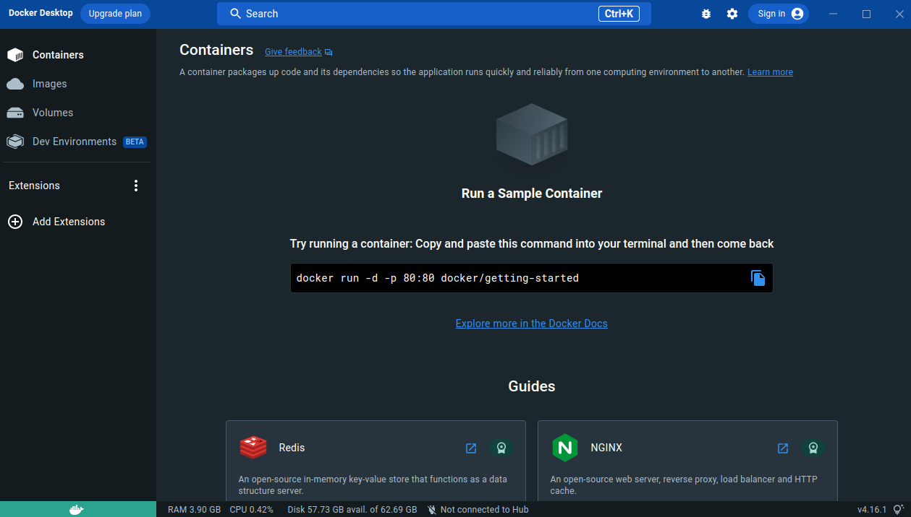
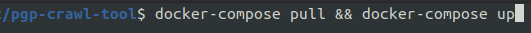
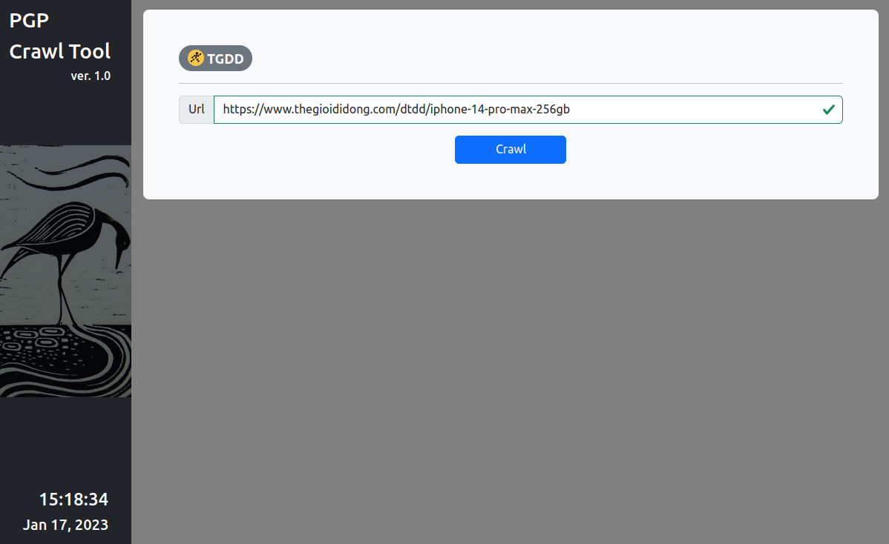
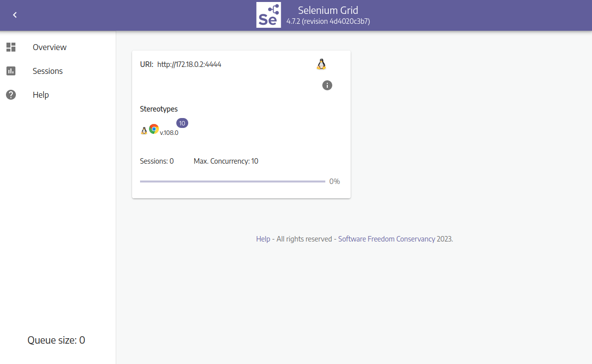

# PGP Crawl Tool

## Tutorials

### Installation & Usage

<ol>
    <li>
        Install <a href='https://www.docker.com/products/docker-desktop/'>Docker Desktop</a>
    </li>
    <li>
        Run <strong>Docker Desktop</strong>
    </li>
    

        
    

    <li>
        Clone this <a href='https://github.com/pgp-the-zoo/pgp-crawl-tool'>git repository</a> to your local machine
    </li>
    <li>
        Go to the directory of <strong><code>docker-compose.yml</code></strong> => run cmd: <strong><code>docker compose pull && docker compose up</code></strong>
    </li>
    

        
    

    <li>
        After the cmd has done running, open your <strong>web browser</strong> to use the tools at:
        <ul>
            <li>
                Crawl Tool: <strong><code>localhost:5000</code></strong>
            </li>
            

                
            

            <li>
                Selenium Grid Monitor: <strong><code>localhost:4444</code></strong>
            </li>
            

                
            

        </ul>
    </li>
</ol>
